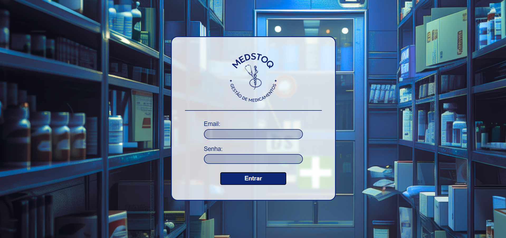
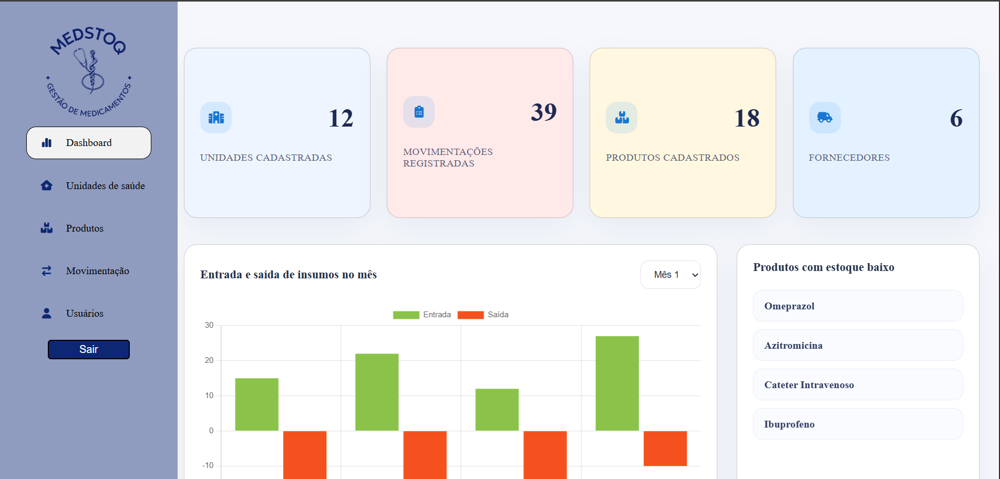
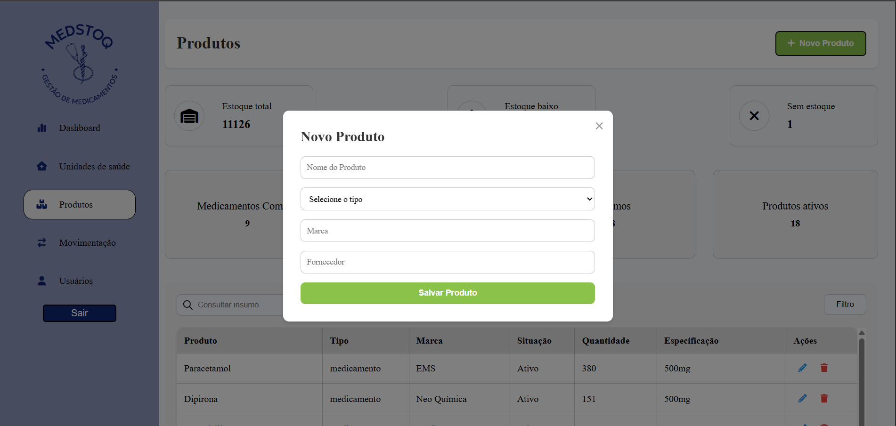
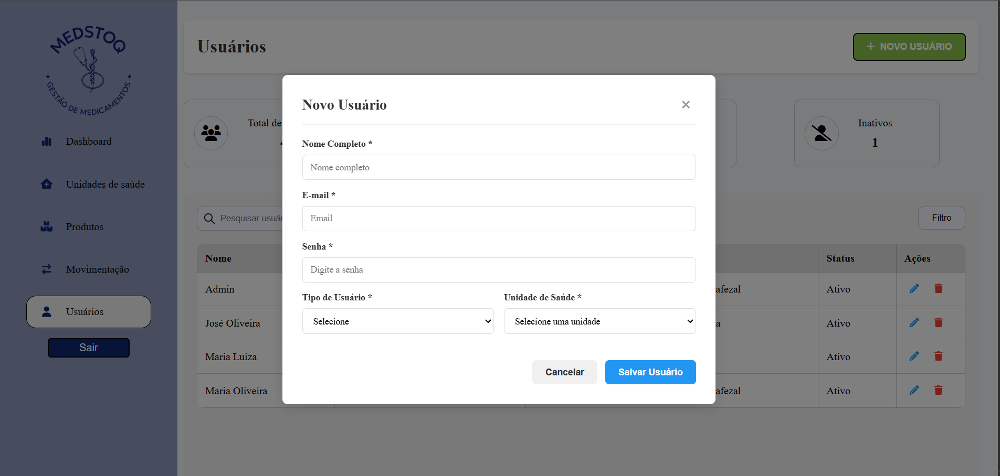

# 💊 MedStoq

Sistema web para gerenciamento de medicamentos e insumos em unidades de saúde, desenvolvido como projeto acadêmico. O sistema permite o controle de produtos, usuários, unidades de saúde e movimentações de estoque por meio de uma API REST integrada ao banco de dados MySQL.

---

## 📖 Sobre o Projeto

O MedStock foi desenvolvido com o objetivo de facilitar o gerenciamento de estoques de medicamentos e insumos utilizados em unidades de saúde.

A aplicação permite cadastrar produtos, controlar entradas e saídas do estoque, gerenciar usuários e unidades de saúde, centralizando todas as informações em um banco de dados MySQL.

---

## ✨ Funcionalidades

- Cadastro de usuários
- Cadastro de unidades de saúde
- Cadastro de produtos
- Controle de estoque
- Registro de movimentações
- Operações CRUD
- API REST
- Autenticação de usuários

---

## 🛠️ Tecnologias Utilizadas

### Backend

- Node.js
- Express
- JavaScript

### Banco de Dados

- MySQL

### Front-end

- HTML5
- CSS3
- JavaScript

### Ferramentas

- Git
- GitHub

---

## 📂 Estrutura do Projeto

```text
📦 projeto_medstok
├── backend
│   ├── data
│   ├── models
│   ├── routes
│   ├── server.js
│   ├── db.js
│   └── package.json
│
├── database
│   └── sql
│       └── database.sql
│
├── frontend
│   ├── css
│   ├── img
│   ├── js
│   ├── dashboard.html
│   ├── login.html
│   ├── movimentacao.html
│   ├── produto.html
│   ├── unidade.html
│   └── usuarios.html
│
└── README.md
```

---

## 🚀 Como Executar

### Clone o repositório

```bash
git clone https://github.com/LFFavoretto/MedStock.git
```

### Entre na pasta

```bash
cd projeto_medstok/backend
```

### Instale as dependências

```bash
npm install
```

### Configure o banco de dados

1. Crie um banco MySQL.
2. Execute o script:

```
database/sql/database.sql
```

3. Configure o arquivo `.env`.

Exemplo:

```env
DB_HOST=localhost
DB_USER=root
DB_PASSWORD=sua_senha
DB_NAME=projeto_medstock

JWT_SECRET=sua_chave
```

### Execute o servidor

```bash
npm start
```

---

## 📷 Demonstração

### Login

> 

---

### Dashboard

> 

---

### Cadastro de Produtos

> 

---

### Cadastro de Usuários

> 

---

## 👥 Equipe

Projeto desenvolvido durante a graduação em Análise e Desenvolvimento de Sistemas.

**Integrantes**

- Lian Marinheiro
- Lucas Abrahão
- Lucas Ribeiro
- Luiz Favoretto

---

## 📄 Licença

Projeto desenvolvido para fins acadêmicos.